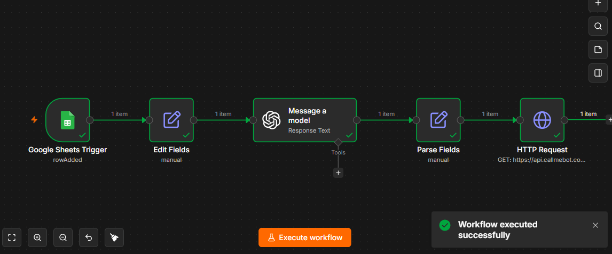
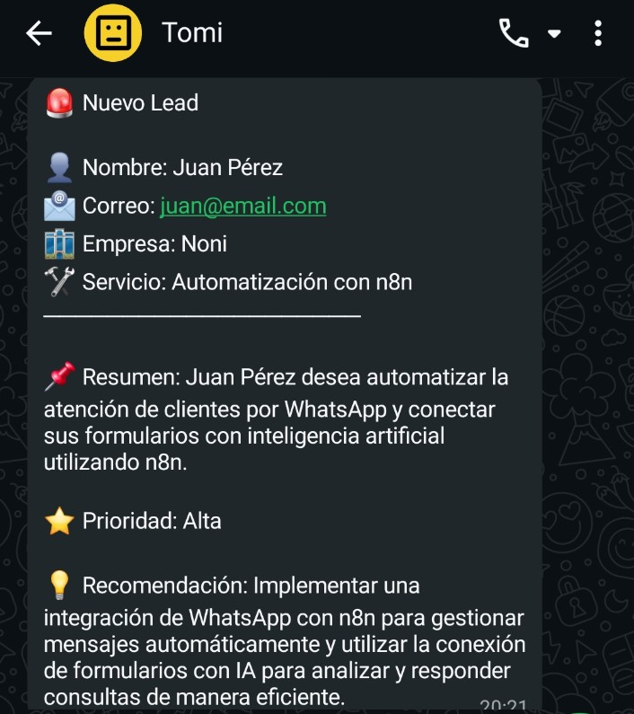

# Project 02 — AI Lead Notification Automation

AI-powered lead processing and notification workflow built with **n8n, OpenAI, Google Sheets, HTTP APIs, and WhatsApp**.


---

## Workflow Execution

The workflow was successfully executed end-to-end in n8n, with all workflow nodes completing successfully.



## WhatsApp Notification

The final output of the automation is delivered as a WhatsApp notification containing the original lead information and the AI-generated analysis.



---

## Overview

This project automates the first stage of lead qualification and notification.

When a potential customer submits a Google Form, the response is stored in Google Sheets. n8n detects the new lead, processes the information with OpenAI, structures the AI response, and sends a WhatsApp notification containing the lead summary, priority, and recommended next action.

The goal of this project is not simply to connect automation nodes, but to understand how **data moves between systems, how APIs interact, how AI outputs can be structured, and how real-world automation workflows can be debugged and validated.**

---

## Architecture

```text
Google Forms
      ↓
Google Sheets
      ↓
Google Sheets Trigger
      ↓
Edit Fields
      ↓
OpenAI — GPT-4.1-mini
      ↓
Parse Fields
      ↓
HTTP Request
      ↓
CallMeBot API
      ↓
WhatsApp Notification
```

---

## Workflow

The automation performs the following steps:

1. Detects a new lead in Google Sheets.
2. Extracts and normalizes the relevant lead information.
3. Sends the lead's service interest and project description to OpenAI.
4. Generates:

   * A concise summary
   * A priority level: **Alta, Media, or Baja**
   * A recommended next action
5. Parses the AI response into structured fields.
6. Sends the original lead information and AI analysis through WhatsApp.

---

## Example Output

```text
🚨 New Lead

👤 Name: John Smith
📧 Email: john@example.com
🏢 Company: Example Company
🛠 Service: Automation Consulting

📌 Summary: The prospect is looking to automate
an internal lead management process.

⭐ Priority: High

💡 Recommendation: Contact the prospect to
clarify requirements and schedule a discovery call.
```

---

## Technologies

* **n8n** — Workflow orchestration
* **OpenAI GPT-4.1-mini** — Lead analysis
* **Google Forms** — Lead intake
* **Google Sheets** — Lead data storage
* **HTTP APIs** — External service integration
* **CallMeBot** — WhatsApp messaging
* **WhatsApp** — Operational notification channel
* **JSON** — Structured data processing
* **n8n Expressions** — Data transformation

---

## Security

The workflow included in this repository has been **sanitized for public use**.

Personal identifiers, API keys, credentials, private resource IDs, and n8n instance metadata have been replaced or removed.

Before running the workflow, configure your own:

* Google Sheets credentials
* OpenAI credentials
* CallMeBot API key
* WhatsApp phone number
* Google Sheet ID
* Sheet GID

> **Note:** Never commit API keys, credentials, phone numbers, tokens, or other secrets to a public repository.

---

## Debugging & Validation

During development, the workflow was tested from lead submission through final WhatsApp delivery.

One important debugging lesson was that an HTTP request can technically return a response while the external service has not successfully completed the intended business operation.

This highlighted the importance of:

* Inspecting API responses
* Validating external service status
* Distinguishing HTTP-level success from business-level success
* Adding proper error handling and response validation to production workflows

---

## What I Learned

This project focuses on understanding how different automation components work together rather than simply connecting pre-built nodes.

Key concepts practiced:

* Event-driven automation
* API integrations
* LLM integration
* Prompt design
* JSON parsing
* Data transformation
* n8n expressions
* Workflow debugging
* API response inspection
* Credential and secret management
* Automated operational notifications
* End-to-end workflow validation

---

## Future Improvements

Possible future iterations include:

* Structured output validation
* Error handling and retry logic
* Persistent lead storage
* CRM integration
* Configurable lead scoring
* Human approval before contacting high-priority leads
* Direct WhatsApp Business API integration
* Logging and monitoring
* Database integration
* Lead history and analytics

---

## Project Status

**Completed — Working end-to-end prototype**

The current version successfully demonstrates:

**Lead submission → Data processing → AI analysis → Structured output → API integration → WhatsApp notification**

---

## Portfolio Context

This is **Project 02** in my AI Automation Engineering learning lab.

The lab focuses on building practical automation systems while developing skills in:

**n8n · Python · APIs · Webhooks · AI · Databases · Integrations · Debugging · Cloud Services**

The objective is to progressively move from individual automation workflows toward more complex, production-oriented AI automation systems.
